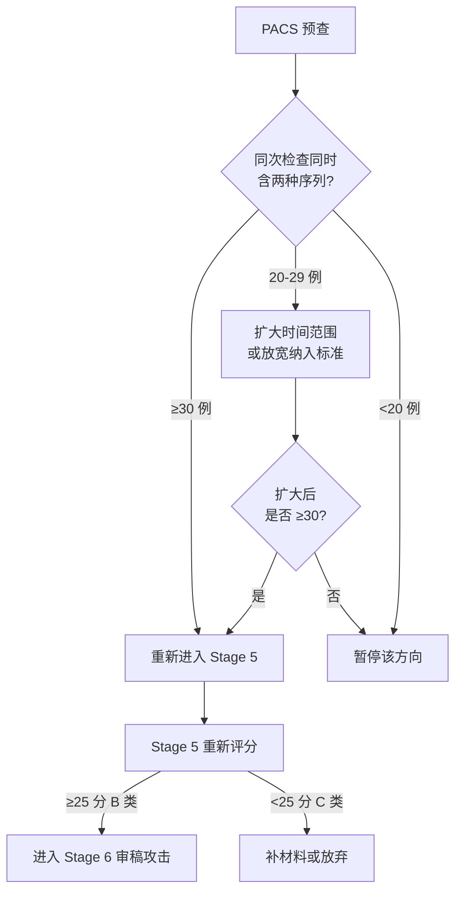

# PACS Pre-Check Plan

**生成日期：** 2026-06-07
**对应题目：** 自由呼吸 GRASP 动态增强 MRI 对呼吸配合不佳患者动脉期图像质量和运动伪影的影响：一项单中心回顾性探索性研究
**执行状态：** 预查方案（尚未执行）

---

## 1. 预查目的

确认 PACS 中是否存在足够数量的、同一次腹部增强 MRI 检查内同时包含 GRASP 自由呼吸序列和传统屏气 3D-T1 动态增强序列的患者数据。**这不是正式数据提取，仅用于判断方向是否可行。**

---

## 2. 查询时间范围

| 参数 | 建议值 | 说明 |
|------|--------|------|
| 起始时间 | 向前推 24 个月 | 从当前日期或 GRASP 序列在本院启用日期开始 |
| 终止时间 | 当前日期 | 含未归档的近期数据 |
| 扩展备选 | 如果 <30 例，可扩展至 36 个月 | 但需注意序列参数可能随时间变化 |

## 3. 查询对象

| 条件 | 说明 |
|------|------|
| 检查部位 | 腹部（肝脏、上腹部、腹部） |
| 检查类型 | 动态增强 MRI（含对比剂注射） |
| 年龄 | 成年患者（≥18 岁） |
| 排除 | 儿童患者、非诊断性扫描、术后复查特殊协议 |

## 4. 必需序列

| 序列 | DICOM 序列描述关键词（示例） | 说明 |
|------|----------------------------|------|
| GRASP 自由呼吸序列 | "GRASP", "Golden-angle Radial", "Radial 3D T1" | 径向 K 空间填充的自由呼吸动态采集 |
| 传统屏气 3D-T1 序列 | "3D T1", "THRIVE", "VIBE", "LAVA", "3D T1 FFE", "T1 High Res" | Cartesian 采集的屏气动态增强序列 |

**注意：** 不同厂家的命名不同（如 Philips 的 THRIVE、Siemens 的 VIBE、GE 的 LAVA），需根据本院设备型号调整关键词。

## 5. 最低样本数判断标准

| 条件 | 判断 |
|------|------|
| 同次检查同时含 GRASP 和屏气 3D-T1 ≥ 30 例 | 可以重新进入 Stage 5，进入正式评分 |
| 20 到 29 例 | 只能做非常初步的探索性分析，需要进一步收缩题目或扩大时间范围 |
| 少于 20 例 | 暂停该方向，不建议继续 |
| 不能判断呼吸配合不佳（运动伪影无法评分） | 暂停主假设，改为一般图像质量比较（失去原创新点） |
| 不能安排 ≥2 名读片医生 | 不建议继续图像质量评分研究 |

**注意：** ≥30 例只是最低探索门槛，不代表样本量足够发表。不能把这个门槛写成统计学功效充分。

## 6. 需要导出的最小字段

见 `pacs_query_field_list.csv`。共 20 个字段，其中仅需匿名 ID 和序列层面的 DICOM header 信息，不涉及临床结局数据。

## 7. 不允许导出的隐私字段

| 字段 | 原因 |
|------|------|
| 患者姓名 | DICOM 标签 (0010,0010)，直接标识 |
| 身份证号 | 如存在 DICOM tag 中 |
| 手机号码 | RIS 系统字段 |
| 住址 | RIS 系统字段 |
| 完整住院号/病历号 | 可以用匿名化后的研究 ID 替代 |
| 社保号/医保号 | 如有存储 |

**替代方案：** PACS 导出时使用匿名化 DICOM，或仅导出序列清单（不导出图像本身）。

## 8. 数据匿名化要求

- 如果仅统计数量（不做图像导出）：无需匿名化，仅读取 DICOM header 中的序列描述即可
- 如果后续需要导出 DICOM 图像进行评分：必须在导出时使用 DICOM 匿名化工具去除所有 PHI 标签
- 推荐匿名化工具：临床 PACS 自带的匿名化导出功能，或使用 `pydicom` 的 `ds.deidentifier` 模块
- 匿名化确认：导出后随机抽查 5 例确认无 PHI 残留

## 9. 无 PACS 权限时的操作路径

```
研究者 → 影像科/磁共振组长/技师 → 如下请求：

"老师您好，我们想初步看一下本院 GRASP 序列的使用情况，
需要帮忙在 PACS 中查一下三个数字：

1. 最近 2 年本院腹部动态增强 MRI 总数
2. 其中用了 GRASP 序列的例数
3. 其中同一次检查同时做了 GRASP 和常规屏气 3D-T1 的例数

只需要统计数量，不需要导出任何图像，不需要患者信息。
如果方便的话，5-10 分钟就可以在 PACS 工作站查完。
谢谢！"
```

完整沟通文本见 `pacs_precheck_request_to_radiology.md`。

## 10. 预查结果如何决定是否重新进入 Stage 5



**决策文件：** `stage_5_6_decision.md`
